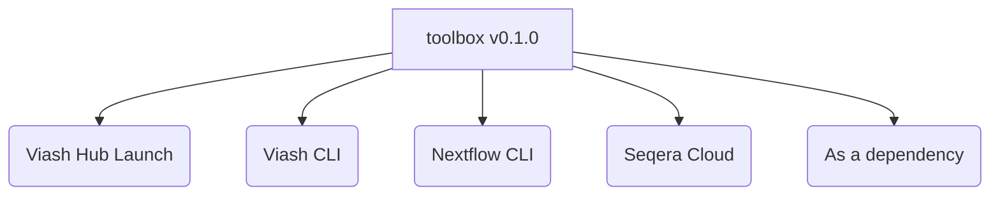
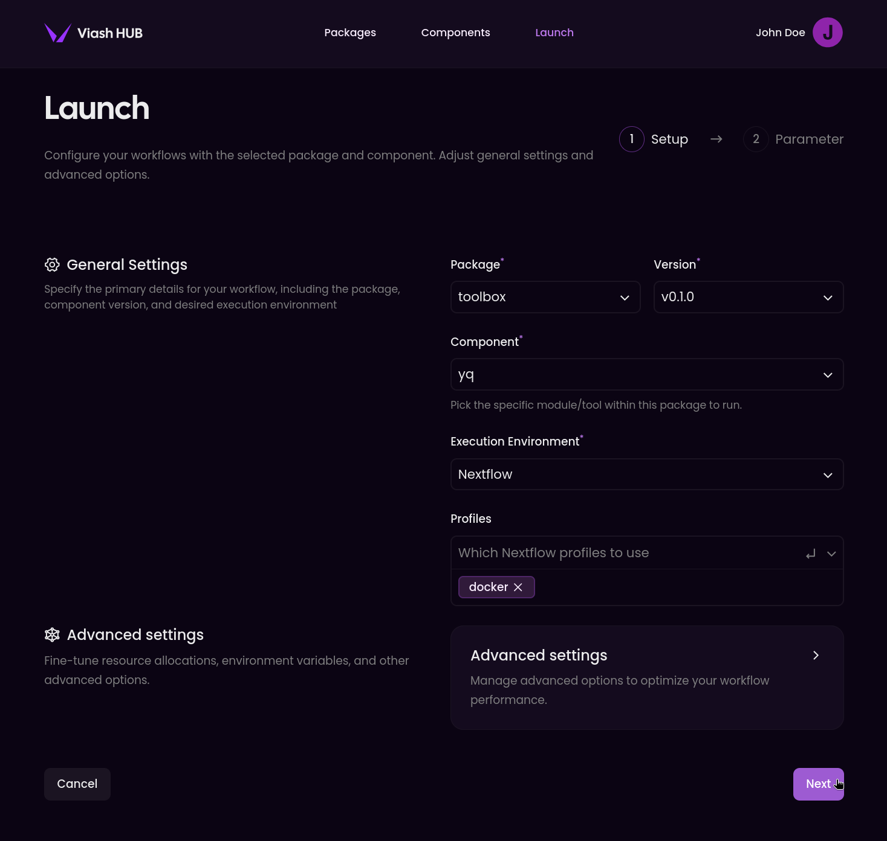

# 🛠📦 toolbox

[](https://www.viash-hub.com/packages/toolbox)
[](https://github.com/viash-hub/toolbox)
[](https://github.com/viash-hub/toolbox/blob/main/LICENSE)
[](https://github.com/viash-hub/toolbox/issues)
[](https://viash.io)

A collection of curated command-line tools for general IT tasks, built
with Viash.

## Introduction

`toolbox` provides a versatile suite of IT components, following the
robust Viash (https://viash.io) framework. This package focuses on
delivering reliable, standalone tools that can be easily integrated into
larger computational workflows.

The core philosophy emphasizes **reusability**, **reproducibility**, and
adherence to **best practices** in component creation. Key features of
`toolbox` components include:

- **Standalone & Nextflow Ready:** Execute components directly from the
  command line or seamlessly incorporate them into Nextflow workflows.
- **High Quality Standards:**
  - Comprehensive documentation for each component and its parameters.
  - Full exposure of the underlying tool’s arguments for maximum
    flexibility.
  - Containerized (Docker) to ensure consistent environments and manage
    dependencies, leading to enhanced reproducibility.
  - Unit tested to verify functionality and ensure reliability.

## Example Usage

Viash components in toolbox can be run in various ways:



### 1. Via the Viash Hub Launch interface

You can run this component directly from the Viash Hub [Launch
interface](https://www.viash-hub.com/launch?package=toolbox&version=v0.1.0&component=yq&runner=Executable).



### 2. Via the Viash CLI

You can run this component directly from the command line using the
Viash CLI.

``` bash
viash run vsh://toolbox@v0.1.0/yq -- --help

viash run vsh://toolbox@v0.1.0/yq -- \
  --input path/to/input.yaml \
  --output output.yaml
```

This will run the component with the specified input files and output
the results to the specified output file.

### 3. Via the Nextflow CLI or Seqera Cloud

You can run this component as a Nextflow pipeline.

``` bash
nextflow run https://packages.viash-hub.com/vsh/toolbox \
  -revision v0.1.0 \
  -main-script target/nextflow/yq/main.nf \
  -latest -resume \
  -profile docker \
  --input path/to/input.yaml \
  --publish_dir path/to/output
```

**Note:** Make sure that the [Nextflow
SCM](https://www.nextflow.io/docs/latest/git.html#git-configuration) is
set up properly. You can do this by adding the following lines to your
`~/.nextflow/scm` file:

``` groovy
providers.vsh.platform = 'gitlab'
providers.vsh.server = 'https://packages.viash-hub.com'
```

**Tip:** This will also work with Seqera Cloud or other
Nextflow-compatible platforms.

### 4. As a dependency

In your Viash config file (`config.vsh.yaml`), you can add this
component as a dependency:

``` yaml
dependencies:
  - name: yq
    repository: vsh://toolbox@v0.1.0
```

**Tip:** See the [Viash
documentation](https://viash.io/guide/nextflow_vdsl3/create-a-pipeline.html#pipeline-as-a-component)
for more details on how to use Viash components as a dependency in your
own Nextflow workflows.

## Contributing

Contributions are welcome! We aim to build a comprehensive collection of
high-quality bioinformatics components. If you’d like to contribute,
please follow these general steps:

1.  Find a component to contribute
2.  Add config template
3.  Fill in the metadata
4.  Find a suitable container
5.  Create help file
6.  Create or fetch test data
7.  Add arguments for the input files
8.  Add arguments for the output files
9.  Add arguments for the other arguments
10. Add a Docker engine
11. Write a runner script
12. Create test script
13. Create a `/var/software_versions.txt` file

See the
[CONTRIBUTING](https://github.com/viash-hub/toolbox/blob/main/CONTRIBUTING.md)
file for more details.
